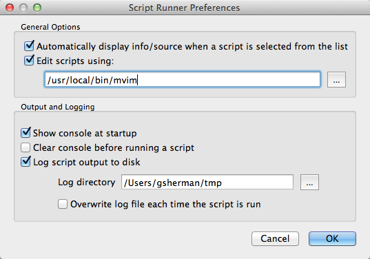

Script Runner Documentation
===========================

The Script Runner plugin allows you to manage and execute a collection of scripts in QGIS to automate tasks and perform custom processing.

Design Options
==============

The script can use two approaches to access the QGIS API:

1.  Use the qgis.utils.iface object
2.  Import qgis.core and qgis.gui and any other needed modules

In the first method, you are limited to to only those methods supported by the [QgisInterface](http://doc.qgis.org/api/classQgisInterface.html) class. In the second you have full access to the PyQGIS API.

Additionally your scripts can contain just functions or you can structure them using classes.

Requirements
------------

In order for Script Runner to execute your script you must define a *run\_script* function that accepts at least one argument. This is the standard entry point used by Script Runner. A reference to the *qgis.utils.iface* object will be passed to your *run\_script* function. You don't have to use the iface object and its methods in your script, but your *run\_script* function must accept it as the first (or only) argument:

``` sourceCode
def run_script(iface):
    # do some stuff
```

Using Script Runner
===================

Adding Scripts
--------------

To run a script, you must add it to Script Runner using the Add Script tool on the toolbar. Select the script from the file dialog to add it to a list in the left panel. The list of scripts is persisted between uses of QGIS.

Running a Script
----------------

To run a script, select it from your list of scripts and click the Run tool. Output from the script will be displayed in the Script Runner console

Remove a Script
---------------

You can remove a script by selecting it from the list and clicking the Remove Script tool. This just removes it from the list; it does nothing to the script file on disk.

Script Information
------------------

Clicking the Info tool will populate the Info and Source tabs in the panel on the right. The Info tab contains the docstring from your module and then a list of the classes, methods, and functions found in the script. Having a proper docstring at the head of your script will help you determine the purpose of script.

*At version 0.6+, the* Info *tool is only needed if you have disabled automatic display of info/source (see* Preferences\_ *).*

Viewing the Source
------------------

You can view the source of the script on the Source tab. This allows you to quickly confirm that you are using the right script and it does what you think it will.

Preferences
-----------

The Preferences dialog allows you to set the following options:



Working with Scripts
====================

To run a script, you must add it to Script Runner using the Add Script tool on the toolbar. This will add it to a list in the left panel. This list of scripts is persisted between uses of QGIS. You can remove a script using the Remove Script tool. This just removes it from the list; it does nothing to the script file on disk.

Once you have a script loaded, you can click the Script Info tool to populate the Info and Source tabs in the panel on the right. The Info tab contains the docstring from your module and then a list of the classes, methods, and functions found in the script. Having a proper docstring at the head of your script will help you determine the purpose of script.

You can view the source of the script on the Source tab. This allows you to quickly confirm that you are using the right script and it does what you think it will.

Output Console
--------------

All print statements in your script will be directed to the Script Runner console. In addition, any tracebacks from exceptions will be displayed there, as well as in a popup dialog.

Printing messages to the console can be useful for both development and status updates in long running scripts. You can clear the console using the Clear
Console tool. There is also an option in Preferences to clear the console each time a script is run.

Logging to Disk
---------------

You can choose to log everything that goes to the output console to disk. Use the Preferences dialog to setup the directory where the scriptrunner.log will be written.

Editing a Script
----------------

You can open the selected script in an external editor by right-clicking on it and choosing Edit script in external editor from the popup menu. The default system editor for *.py* files will be used to open the script. In Preferences, you can specify a different editor by entering the full path to the executable.

Passing Arguments
-----------------

You can pass mandatory as well as keyword arguments to your script. Script Runner examines your script at runtime and presents you with a dialog for entering each argument:


As mentioned previously, the first argument to *run\_script* function must be iface. After that you can have one or more mandatory arguments:

``` sourceCode
def run_script(iface, data_path, buffer_size):
```

You can also use keyword arguments:

``` sourceCode
def run_script(iface, **myargs):
```

Or you can combine the two:

``` sourceCode
def run_script(iface, data_path, buffer_size, **myargs):
```

Scripts that accept arguments are displayed in the list with two asterisks appended to their name:


Keyword Arguments
-----------------

In Script Runner, you specify keyword arguments using key=value pairs. All string values must be quoted. The image below shows two keyword arguments entered for a script, with the string value quoted:


When your script is run, the keyword arguments are contained in the variable you specified with two asterisks; a Python dict.

You access the passed values using the key:

``` sourceCode
def run_script(iface, **myargs):
    data_path = myargs['data_path']
    my_buffer_size = myargs['buffer_size']
```

Script Examples
===============

This section provides examples of scripts that run in Script Runner:

-   A simple script with no user arguments and a single function
-   A script that uses a class
-   A script that accepts arguments

A Simple Script
---------------

This simple script contains only a *run\_script* function:

``` sourceCode
""" Load a layer and change the fill color to red. """
from PyQt5.QtCore import *
from PyQt5.QtGui import *
from qgis.core import *
from qgis.gui import *


def run_script(iface):
    project = QgsProject.instance()
    project.removeAllMapLayers()
    wb = QgsVectorLayer('/Users/gsherman/Downloads/pyqgis_data/world_borders.shp', 'world_borders', 'ogr')
    project.instance().addMapLayer(wb)
    renderer = wb.renderer()
    symb = renderer.symbol()
    symb.setColor(QColor(Qt.red))
    wb.triggerRepaint()
    iface.layerTreeView().refreshLayerSymbology(wb.id())
```

When executed by Script Runner, the script removes any layers currently on the map, then loads the world\_borders shapefile, sets its fill color to red, and updates the map canvas and the legend. The *run\_script* function does all the work. You could expand this script by adding additional functions that are called from *run\_script*.

A Script with a Class
---------------------

This script uses a class that is initialized from the *run\_script* function to load some layers:

``` sourceCode
"""Load all shapefiles in a given directory.  """
from glob import glob
from os import path

from qgis.core import *
from qgis.gui import *
import qgis.utils


class Loader:
    def __init__(self, iface):
        """Initialize using the qgis.utils.iface
        object passed from the console.
        """

        self.iface = iface  #qgis.utils.iface
        self.if2 = self.iface
        #print("iface in __init__ is %" % self.iface)

    def load_shapefiles(self, shp_path):
        """Load all shapefiles found in shp_path"""
        print("Loading shapes from %s" % path.join(shp_path, "*.shp"))
        shps = glob(path.join(shp_path, "*.shp"))
        for shp in shps:
            (shpdir, shpfile) = path.split(shp)
            print("Loading %s" % shpfile)
            print("if2 is %s" % type(self.if2))
            lyr = self.iface.addVectorLayer(shp, shpfile, 'ogr')
            #QgsMapLayerRegistry.instance().addMapLayer(lyr)


def run_script(iface):
    ldr = Loader(iface)
    print("in run script")
    print("iface in run_script is %s" % iface)
    print("Loading all shapefiles in /dev1/gis_data/qgis_sample_data/shapefiles")
    ldr.load_shapefiles('/Users/gsherman/Downloads')
```

In this example, the *run\_script* function creates an instance (ldr) of a class named *Loader* that is defined in the same source file. It then calls a method in the *Loader* class named *load\_shapefiles* to do something useful---in this case, load all the shapefiles in a specified directory.

A Script that Accepts Arguments
-------------------------------

This script accepts three arguments in addition to iface. The first two are mandatory arguments and the third (shape\_path) is a keyword argument:


``` sourceCode
"""Load all shapefiles in a given directory."""
from glob import glob
from os import path
from qgis.core import *
from qgis.gui import *
import qgis.utils


class Loader:
    def __init__(self, iface):
        """Initialize using the qgis.utils.iface
        object passed from the console.

        """
        self.iface = qgis.utils.iface

    def load_shapefiles(self, shp_path):
        """Load all shapefiles found in shp_path"""
        print("Loading shapes from %s" % path.join(shp_path, "*.shp"))
        shps = glob(path.join(shp_path, "*.shp"))
        for shp in shps:
            (shpdir, shpfile) = path.split(shp)
            print("Loading %s" % shpfile)
            lyr = QgsVectorLayer(shp, shpfile, 'ogr')
            QgsProject.instance().addMapLayer(lyr)


def run_script(iface, data_path, buffer_size, **myargs):
    ldr = Loader(iface)
    print("Loading all shapefiles in %s" % myargs['shape_path'])
    ldr.load_shapefiles(myargs['shape_path'])
    # Do something with data_path and buffer_size...
    print("data_path = %s" % data_path)
    print("buffer_size = %s" % buffer_size)
```

These examples are minimalistic---they don't do error checking in a number of places, such as checking to see if a QgsVectorLayer is valid or if needed arguments were actually passed to the script. Don't take the scripts as examples of complete, solid code.

Troubleshooting
===============

If you get a traceback with a KeyError such as this:


it means that you failed to provide a keyword argument prior to running the script. In the example above, the data\_path keyword was not provided.
